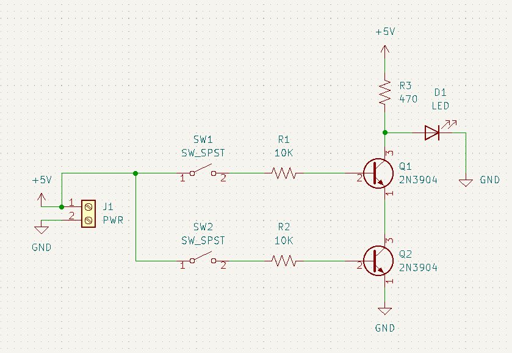

# nand-pcb-test

Homemade PCB test using a CNC router and laser.

Hopefully this is useful to someone else wanting a single place to see the whole PCB building process.

## Why?

There are plenty of companies that offer cheap PCB manufacturing, but I'm impatient and bad at designing things correctly on the first try.
Imagine ordering a PCB, waiting a few days, and figuring out you messed up your design.
Manufacturing with a CNC router helps to eliminate waiting time between idea and implementation.

Alternatively, plenty of people use the chemical etching process (example: thermal transfer paper and ferric chloride) to build their PCBs.
I just don't have a good workspace to mess with nasty chemicals, so the CNC approach is more doable for me.
Maybe I'll also add a chemical etching bonus section in the future.

## Equipment

- [Genmitsu 3020-PRO MAX V2 CNC Router](https://www.sainsmart.com/collections/new-genmitsu-collection/products/3020-pro-max-v2)
  - [3040 Y-Axis Extension Kit](https://www.sainsmart.com/collections/genmitsu-cnc-replacement-upgrade-parts/products/3020-yaxis-extension-kit)
  - [RFL10W 10W Compressed FAC Laser Module](https://www.sainsmart.com/collections/genmitsu-cnc-replacement-upgrade-parts/products/10w-compressed-fac-laser-module-with-air-assist-nozzle-for-genmitsu-cnc-laser-machine)
- [FR-4 Copper Clad PCB Laminate Board, Single Side, 4 x 2.7 inch (10 piece)](https://www.amazon.com/dp/B01MCVLDDZ)
- TODO: bits
- TODO: BOM

TODO: image of CNC

## Build Process

### Circuit Design and Prototyping

- Design circuit in Kicad Schematic Editor
- Design/Simulate circuit in LTSpice (optional)
- Breadboard implementation
- Protoboard implementation (optional)
- Kicad Schematic Editor
  - Inspect > Electrical Rules Checker
  - Tools > Annotate Schematic
  - Tools > Assign Footprints
  - TODO: Create Bill of Materials (BOM)
  - TODO: Export circuit to PDF

TODO: breadboard image

TODO: protoboard image

TODO: LTSpice sim

### PCB Design

- Open Kicad PCB Editor (or from Kicad Schematic Editor: Tools > Update PCB From Schematic)
- Generally only use back copper and front silkscreen
- Rearrange rats nest of components to eliminate overlap
- Set design rules (File > Board Setup...)
  - Minimum clearance = 0.5mm (~20 mil)
  - Minimum track width = 1mm (~40 mil)
  - Copper to edge clearance = 0mm
- Route tracks on `B.Cu` (back copper) layer. Ignore ground pins, will be filled later
- Select `Edge.Cuts` layer, draw a rectangle to trace board boundary, thickness 1mm
- Select `B.Cu` layer and add fill for ground
- Right click fill edge, Zones > Fill Zone
- Add orthogonal dimensions to `Edge.Cuts` layer to double check board width/height
- Place origin at top left of board
- Export Gerber files
  - Drill marks = Actual size
  - Export units: Millimeters
  - export `B.Cu`, `Edge.Cuts`
  - TODO: export front silkscreen for laser

TODO: kicad pcb

### Computer Aided Manufacturing (CAM)

TODO: FlatCAM

- Cut Z = -0.05mm
- Travel Z = 2.0mm
- Feed rate = 100.0mm/min
- Tool dia = 0.1mm
- Spindle speed = 12000rpm
- Multi-depth = yes
- Depth/pass = 0.01mm

### Preparing Silkscreen

TODO: vector image - inkscape for laser?

### Milling

TODO: Candle (grblControl)

- bit - 0.1mm 20deg v bit
- TODO: holes - 0.3mm drill bit?
- TODO: edge - 0.8mm corn bit?

TODO: each bit swap z-axis needs to be re-zeroed

height map: ~10mm between points

### Laser Etching Silkscreen

TODO:

### Final Steps

TODO: Prevent copper corrosion - clear nail polish? liquid tin?

## References

- Candle - https://github.com/trasz/grblControl
- http://flatcam.org/
- https://www.sainsmart.com/
- Youtube
  - [Homemade custom PCB guide using free KiCAD software; Teaching Tech](https://www.youtube.com/watch?v=NgDXPWaA5Ic)
  - [Intro to Kicad - Shawn Hymel](https://www.youtube.com/playlist?list=PL3bNyZYHcRSUhUXUt51W6nKvxx2ORvUQB)
  - [Machining a PCB on the 3-axis CNC Bridgeport Mill; Usagi Electric](https://www.youtube.com/watch?v=AB84_vbH_e8)
  - [Relay Calculators: Episode 8 - Using FlatCAM and a CNC mill to make PCBs; Usagi Electric](https://www.youtube.com/watch?v=F2FRN5z2S78)
  - [Sainsmart Genmitsu 3020 Pro Max - 300W Spindle & Linear Rails - Build, Test & Review; techydiy](https://www.youtube.com/watch?v=5vaAthrJQm0)
