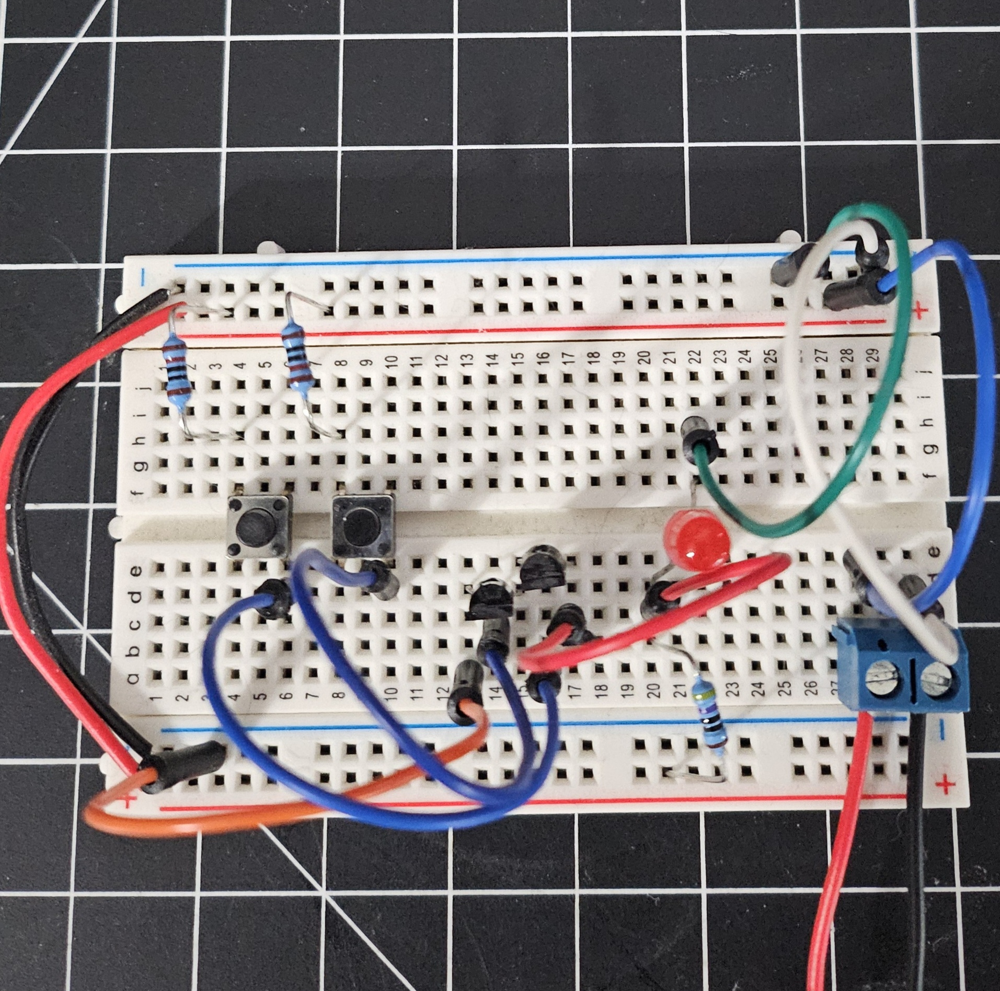

# nand-pcb-test

Homemade PCB test using a CNC router and laser.

Hopefully this is useful to someone else wanting a single place to see the whole CNC PCB building process.
These notes assume you have a basic understanding of Kicad and Candle (grblcontrol).

## Why?

There are plenty of companies that offer cheap PCB manufacturing, but I'm impatient and bad at designing things correctly on the first try.
Imagine ordering a PCB, waiting a few days, and figuring out you messed up your design.
Manufacturing with a CNC router helps to eliminate waiting time between idea and implementation.

Alternatively, plenty of people use the chemical etching process (example: thermal transfer paper and ferric chloride) to build their PCBs.
I just don't have a good workspace to mess with nasty chemicals, so the CNC approach is more doable for me.
Maybe I'll also add a chemical etching bonus section in the future.

## Equipment

- [Genmitsu 3020-PRO MAX V2 CNC Router](https://www.sainsmart.com/collections/new-genmitsu-collection/products/3020-pro-max-v2)
  - [3040 Y-Axis Extension Kit](https://www.sainsmart.com/collections/genmitsu-cnc-replacement-upgrade-parts/products/3020-yaxis-extension-kit)
  - [RFL10W 10W Compressed FAC Laser Module](https://www.sainsmart.com/collections/genmitsu-cnc-replacement-upgrade-parts/products/10w-compressed-fac-laser-module-with-air-assist-nozzle-for-genmitsu-cnc-laser-machine)
- [FR-4 Copper Clad PCB Laminate Board, Single Side, 4 x 2.7 inch (10 piece)](https://www.amazon.com/dp/B01MCVLDDZ)
- TODO: bits

TODO: image of CNC

## Build Process

### Circuit Design and Prototyping

- Design circuit in Kicad Schematic Editor
- Breadboard implementation
- Protoboard implementation (optional)
- Kicad Schematic Editor
  - Inspect > Electrical Rules Checker
  - Tools > Annotate Schematic
  - Tools > Assign Footprints
  - File > Plot > PDF, Plot All Pages

### PCB Design

- Open Kicad PCB Editor (or from Kicad Schematic Editor: Tools > Update PCB From Schematic)
- Generally only use back copper and front silkscreen
- Rearrange rats nest of components to eliminate overlap
- Set design rules (File > Board Setup)
  - Minimum clearance: 0.5mm
  - Minimum track width: 0.5mm
  - Copper to hole clearance: 0.5mm
  - Copper to edge clearance: 0.5mm
  - Minimum through hole: 0.7mm
  - Hole to hole clearance: 0.5mm
- Route tracks on `B.Cu` (back copper) layer. Ignore ground pins, will be filled later
- Select `Edge.Cuts` layer, draw a rectangle to trace board boundary, thickness 1mm
- Select `B.Cu` layer and add fill for ground
- Right click fill edge, Zones > Fill Zone
- Add orthogonal dimensions to `User.Drawings` layer to double check board width/height
- Place origin at top left of board
- Run Design Rules Checker ()
- Export Gerber files (File > Plot)
  - Check Use drill/place file origin
  - Export `B.Cu`, `Edge.Cuts` (used in router step)
  - Export `F.Silkscreen` (used in optional laser silkscreen step) TODO: dxf or svg?
  - Export `B.Mask` (used in optional solder masking step) TODO: dxf or svg?
  - Generate Drill Files (`*-NPTH.drl` and `*-PTH.drl`)
    - Drill Origin = Drill/place file origin
    - Drill Units = Millimeters

### Computer Aided Manufacturing (CAM)

Bits I will be using:

- Isolation routing: 0.1 60deg v-bit
- Holes: 0.8mm drill bit
- Edge cut: 2.5mm end mill bit

- Launch FlatCAM
- Load `B.Cu` and `Edge.Cuts` gerber files (File > Open Gerber)
- Add drill files (File > Open Excellon)
  - Note: Ignore "No geometry found in file" error if no NPTH holes needed
- Options tab
  - Set units to mm
- Select `*-B_Cu.gbr`
  - Isolation Routing section
  - Tool dia: 0.45 (must be less than minimum isolation widths set in Kicad)
  - Width (# passes): 2
  - Pass overlap: 0.75
  - Combine Passes: yes
  - Click Generate Geometry
- Select `*-B_Cu.gbr_iso`
  - Create CNC Job section
  - Cut Z: -0.015
  - Travel Z: 2
  - Feed Rate: 85.0
  - Tool dia: 0.2
  - Spindle speed: 10000
  - Multi-Depth: yes
  - Depth/Pass: 0.08
  - Click Generate
- Select `*-B_Cu.gbr_iso_cnc`, export G-Code to `B_Cu.nc`
- Select `*-PTH.drl`
  - If too many sizes of drills, go back to Kicad and change hole sizes of individual components (we can always redrill by hand later if holes too small)
  - Create CNC Job section
  - Cut Z: -2
  - Travel Z: 2
  - Feed Rate: 100.0
  - Tool Change: no
  - Spindle Speed: 10000
  - Click Generate
- Select `*-PTH.drl_cnc`, set tool dia to 0.8, export G-Code to `PTH.drl.nc`
- Select `*.Edge_Cuts.gbr`
  - Board cutout section
  - Tool dia: 2.5
  - Margin: 0.1
  - Gap size: 1.0
  - Gaps: 4
  - Click Generate Geometry
- Select `*-Edge_Cuts.gbr_cutout`
  - Create CNC Job section
  - Cut Z: -2
  - Travel Z: 2.0
  - Feed Rate: 50.0
  - Tool dia: 2.5
  - Spindle speed: 10000
  - Multi-Depth: yes
  - Depth/pass: 0.25
  - Click Generate
- Select `*-Edge_Cuts.gbr_cutout_cnc`, export G-Code to `Edge_Cuts.nc`

### Preparing Silkscreen (optional)

TODO: vector image - inkscape for laser?

### CNC Routing

Refer to bits in "Computer Aided Manufacturing (CAM)" section

To secure the PCB to the bed, 
I used 3D printed M6 Plate Clamps from https://www.printables.com/model/250450-enhancements-for-sainsmartgenmitsu-3020-pro-max-cn/files. 
Alternatively, I saw a lot of people using carpet tape.

TODO: list job times

- TODO: probe setup
- Jog machine to upper left corner, z probe, zero XY
- Height map
  - Load nc file, click auto
  - Zero XYZ, set bit at origin
  - Probe grid, set to be ~10mm apart
  - Interpolation grid: 20, 20
  - zt = 1.0, zb = -1.0
  - Click Probe
  - Save as `height.map`
  - Click edit mode to leave edit mode
  - Verify use heightmap is checked
- Remove probes
- Load `B.Cu.nc`
- TODO: swap to drill bit, re-zero Z
- Load `PTH.drl.nc`
- TODO: swap to edge cut bit, re-zero Z
- Load `Edge_Cuts.nc`

### Laser Etching Silkscreen (optional)

TODO:

- Launch LaserGrbl
- Grbl > Grbl Configuration
  - $30 = 1000 RPM (configures laser power)
  - $32 = 1 (laser mode)
- Turn on laser low power, adjust Z-axis until dot is as small as possible (finding the focal point)

### Final Steps

- Use 400-600 grit sandpaper and/or steel wool to remove any small burrs
- Clean off with a bit of isopropyl alcohol
- Use multimeter to check all tracks for shorts
- Solder components
- Clean any flux with isopropyl

## References

- [Candle](https://github.com/trasz/grblControl)
- [FlatCAM](http://flatcam.org/)
- [GCODE Reference](https://marlinfw.org/meta/gcode/)
- [LaserGRBL](https://lasergrbl.com/)
- Youtube
  - [3018 Pro - Setting up your laser; James Dean Designs](https://www.youtube.com/watch?v=YnFNFEdmPjU)
  - [3018 Pro - Basics for Laser Engraving; James Dean Designs](https://www.youtube.com/watch?v=pCmazk-yTVo)
  - [Homemade custom PCB guide using free KiCAD software; Teaching Tech](https://www.youtube.com/watch?v=NgDXPWaA5Ic)
  - [Intro to Kicad; Shawn Hymel](https://www.youtube.com/playlist?list=PL3bNyZYHcRSUhUXUt51W6nKvxx2ORvUQB)
  - [Machining a PCB on the 3-axis CNC Bridgeport Mill; Usagi Electric](https://www.youtube.com/watch?v=AB84_vbH_e8)
  - [Milling PCBs on a Homemade CNC (Part 2): Masking](https://www.youtube.com/watch?v=qIxvXU7KDmE)
  - [Milling Printed Circuit Boards (PCBs) on a Cheap CNC Machine; Matt's Electronics & RC](https://www.youtube.com/watch?v=bQ6_oYZrsjk)
  - [Relay Calculators: Episode 8 - Using FlatCAM and a CNC mill to make PCBs; Usagi Electric](https://www.youtube.com/watch?v=F2FRN5z2S78)
  - [Sainsmart Genmitsu 3020 Pro Max - 300W Spindle & Linear Rails - Build, Test & Review; techydiy](https://www.youtube.com/watch?v=5vaAthrJQm0)
